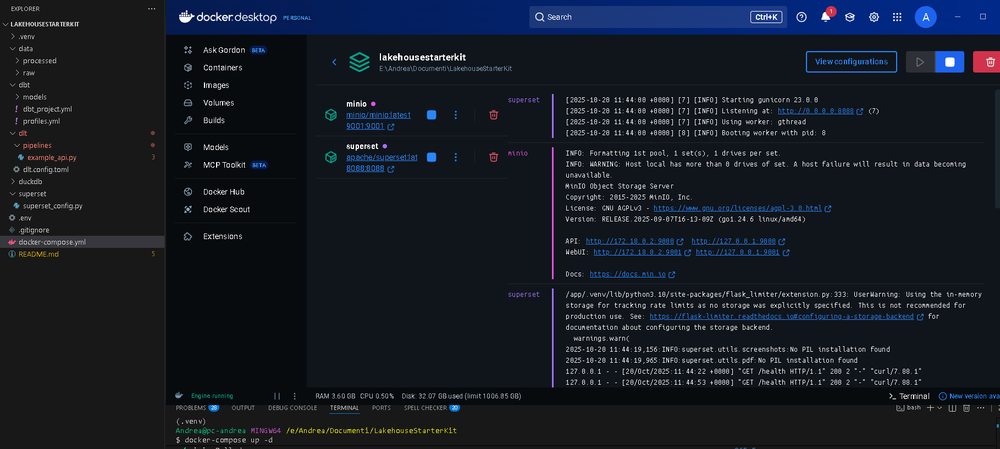
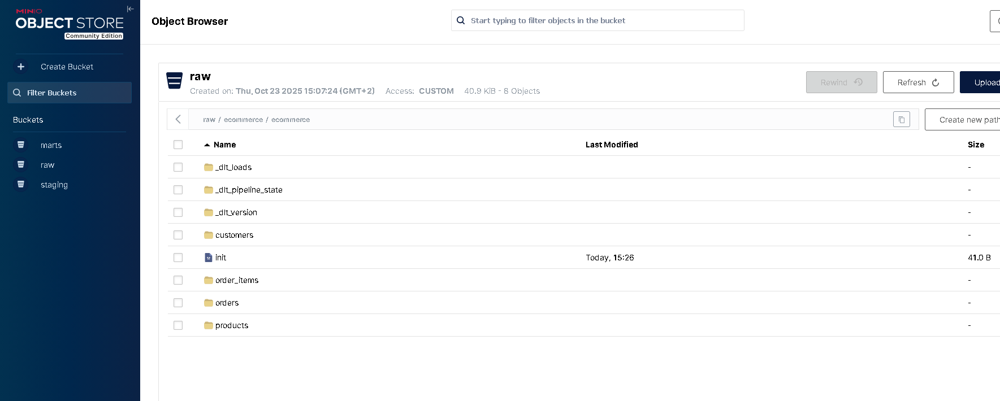

# 🧩 Open Lakehouse Starter




**Version 0.0.2**

Open source lakehouse environment for small teams & startups, modelled to be:

- **light**,
- **expandable**,
- **scalable (S3, Spark, orchestrators, Databricks, etc.)**.

## Architecture

```text
PostgreSQL (source) → dlt → MinIO (S3) → dbt (DuckDB) → Metabase
```

## Stack

- **MinIO**: S3-compatible object storage (data lake)
- **PostgreSQL**: Example source database (e-commerce data)
- **dlt**: Data ingestion (PostgreSQL → MinIO in Parquet format)
- **dbt**: Data transformation (MinIO → analytics models)
- **DuckDB**: Query engine with S3 access via httpfs
- **Metabase**: Data visualization and BI

## Prerequisites

- Docker and Docker Compose
- Python 3.9 or higher
- pip (Python package manager)

## Installation

### 1. Clone the repository

```bash
git clone <your-repo-url>
cd LakehouseStarterKit
```

### 2. Configure environment variables

```bash
cp .env.example .env
# Edit .env and set your passwords (MINIO_PASS, POSTGRES_PASSWORD, etc.)
```

### 3. Create and activate a virtual environment

```bash
python -m venv .venv
# On Windows:
.venv\Scripts\activate
# On Linux/Mac:
source .venv/bin/activate
```

### 4. Install Python dependencies

```bash
pip install -r requirements.txt
```

### 5. Start Docker services

```bash
docker-compose up -d
```

This will start:

- **MinIO** on <http://localhost:9001> (console) and <http://localhost:9000> (API)
- **PostgreSQL** on `localhost:15432` with e-commerce sample data
- **Metabase** on <http://localhost:3000>

Wait 2-3 minutes for services to initialize.

## Quick Start

### 1. Run the data ingestion pipeline

```bash
# Load e-commerce data from PostgreSQL to MinIO (Parquet format)
python dlt/pipelines/ecommerce_postgres.py
```

This creates 4 Parquet files in MinIO `s3://raw/ecommerce/`:

- `customers` (50 records)
- `products` (30 records)
- `orders` (102 records)
- `order_items` (127 records)

### 2. Run dbt transformations

```bash
cd dbt
dbt run
```

This creates 7 models:

- **Staging** (4 views): `stg_ecommerce__customers`, `stg_ecommerce__products`, `stg_ecommerce__orders`, `stg_ecommerce__order_items`
- **Marts** (3 tables): `dim_customers`, `fct_orders`, `mart_sales_summary`

### 3. Run dbt tests

```bash
dbt test
```

Executes 45 data quality tests (unique, not_null, relationships, accepted_values).

### 4. Access the tools

- **MinIO Console**: <http://localhost:9001> (admin / password123)
- **Metabase**: <http://localhost:3000> (setup required on first access)
- **PostgreSQL**: `localhost:15432` (postgres / postgres)

## Project Structure

```text
.
├── dlt/                           # Data ingestion with dlt
│   ├── pipelines/
│   │   ├── ecommerce_postgres.py  # PostgreSQL → MinIO pipeline
│   │   └── example_api.py         # GitHub API example (to be updated)
│   └── dlt.config.toml            # dlt configuration
├── dbt/                           # Data transformation with dbt
│   ├── models/
│   │   ├── staging/               # Staging layer (views)
│   │   │   ├── sources.yml        # Source definitions (MinIO Parquet files)
│   │   │   ├── schema.yml         # Tests and documentation
│   │   │   ├── stg_ecommerce__customers.sql
│   │   │   ├── stg_ecommerce__products.sql
│   │   │   ├── stg_ecommerce__orders.sql
│   │   │   └── stg_ecommerce__order_items.sql
│   │   └── marts/                 # Marts layer (tables)
│   │       ├── schema.yml         # Tests and documentation
│   │       ├── dim_customers.sql  # Customer dimension
│   │       ├── fct_orders.sql     # Orders fact table
│   │       └── mart_sales_summary.sql  # Sales aggregations
│   ├── dbt_project.yml
│   └── profiles.yml               # DuckDB with S3/MinIO config
├── postgres/
│   └── init/
│       ├── 01_schema.sql          # E-commerce database schema
│       └── 02_seed_data.sql       # Sample data (309 records)
├── superset/                      # Superset config (commented out)
│   ├── Dockerfile
│   └── superset_config.py
├── docker-compose.yml             # Docker services (MinIO, PostgreSQL, Metabase)
├── requirements.txt               # Python dependencies
├── .env.example                   # Environment variables template
├── lakehouse.duckdb               # DuckDB database with transformed data
└── docs/
    └── PROJECT_STATUS.md          # Detailed project status
```

## Data Flow

1. **PostgreSQL** (source): E-commerce database with 4 tables
2. **dlt pipeline**: Extracts data and writes Parquet files to MinIO
3. **MinIO**: S3-compatible storage with `raw/` bucket
4. **dbt + DuckDB**: Reads Parquet from MinIO, transforms data, creates analytics models
5. **Metabase**: Connects to DuckDB for visualization

## Next Steps

### Immediate

- Connect Metabase to DuckDB database at `lakehouse.duckdb`
- Create dashboards in Metabase for sales analysis
- Explore data quality with dbt test results

### Short-term

- Update GitHub API pipeline (`dlt/pipelines/example_api.py`) to write to MinIO
- Add orchestration (Prefect or Airflow) for scheduled pipeline runs
- Add more dbt tests and documentation
- Create additional mart models based on business needs

### Long-term

- Scale to cloud S3 (AWS, GCS, Azure)
- Add Spark integration for large-scale processing
- Implement Iceberg table format for better performance
- Add CI/CD pipeline with GitHub Actions
- Implement data quality monitoring

## Troubleshooting

### Metabase not accessible

Wait 2-3 minutes after `docker-compose up`. Check status: `docker ps`

### dbt tests failing

Ensure dlt pipeline ran successfully and Parquet files exist in MinIO.

### Port conflicts

Check `.env` file and modify ports if needed. PostgreSQL uses port 15432 to avoid conflicts.

## Documentation

- [PROJECT_STATUS.md](docs/PROJECT_STATUS.md) - Detailed project status and implementation notes
- [.env.example](.env.example) - Environment variables documentation
- [SECURITY.md](SECURITY.md) - Security policy

## License

MIT License - see LICENSE file for details
